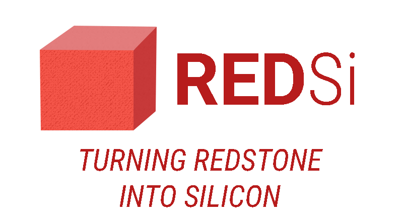

# Setting up Redsi

This is an instructional guide on how to set up Redsi on your Minecraft server to convert your Redstone circuits to Verilog.

## Java Plugin
### Server Requirements

* <a href='https://dev.bukkit.org/bukkit-plugins/worldedit/' target="_blank">_WorldEdit_ Plugin</a>
* `redsi-{current version}-jar-with-dependencies.jar`

Install both plugins on your server and they should both work out of the box. Redsi requires _WorldEdit_ and will produce an error if that plugin cannot be found.

### Selecting a circuit
Use the _WorldEdit_ plugin to create a selection. This selection should be large enough to encompass your entire circuit.

### Execute Redsi
Enter `/redsi` into chat to activate the plugin. It will take all of the blocks you selected and parse a circuit. Then it will send your circuit to the cloud for conversion into Verilog.

#### Additional parameters
The `/redsi` command runs without any additional arguments. However, you can alternately mark some flags to alter the output. You can have one or more flags at a time in any order.

* `--no-build`: This will run through the compilation process locally, but will not upload your circuit to the cloud. This can be useful for local debugging.
* `-v`: This enables verbose log messages in your server's log files.
* `--private`: If the private flag is set, the Verilog will be only sent to the player who started the command. Otherwise, the Url will be broadcast to everyone currently on the server.
* `--print-logs`: This will post log messages in the chatroom.
* `--print-misc`: If blocks within your selection have special data values, these will be printed to the chatroom. This can be useful for local debugging.
* `--print-redsi`: Prints out log statements that relate to Redsi's converter
* `--print-signs`: If any blocks within your selection are signs, their text will be printed to the chatroom.

## Verilog Base Project